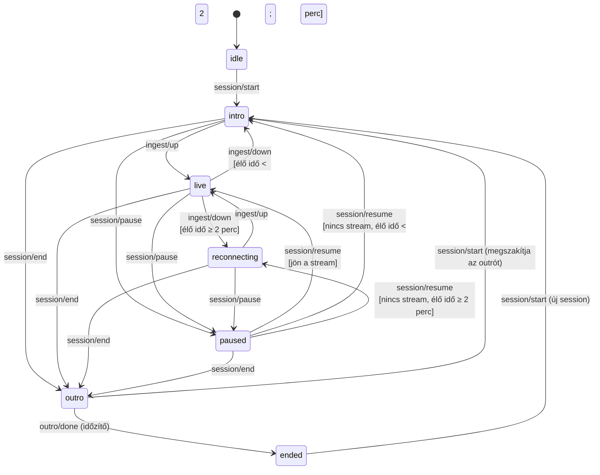

# OnLIVE — 4. szegmens: A vezérlő szerver állapotgépe

> **Ez a rendszer szíve.** Az adás állapotának egyetlen forrása. A telefon nem
> tud az intróról és az outróról, az ingest réteg csak tényeket közöl — a
> jelentést kizárólag ez az állapotgép adja.

Forrás: [`server/`](../server). A gép maga: [`server/src/state/machine.js`](../server/src/state/machine.js).

---

## 1. Állapotok

| Állapot | Mikor lép be | Mit mutat a `/live` oldal |
|---|---|---|
| `idle` | szerver indítás, még sosem volt élő | semmi / statikus képernyő (`blank`) |
| `intro` | „Kezdés" megnyomva; **vagy** 2 percnél rövidebb adás szakadt meg | „Hamarosan kezdünk" kép/videó (`intro`) |
| `live` | van aktív, érkező stream | valós telefon-kép + overlay-k (`live`) |
| `reconnecting` | ≥2 percig élő adás nem szándékosan megszakadt | „Megszakadt" kép/videó (`interrupted`) |
| `paused` | a felhasználó a telefonos Szünet gombbal megállította | **ugyanaz** a „Megszakadt" képernyő (`interrupted`) |
| `outro` | „Befejezés" megnyomva | outro kép/videó, előre definiált ideig (`outro`) |
| `ended` | az outro ideje lejárt | semmi (`blank`), az adás lezárva |

A `screen` mező szándékosan külön van az állapottól: a `paused` és a
`reconnecting` vizuálisan **azonos** — a néző nem tudja, és nem is kell tudnia,
hogy a szakadás szándékos volt-e. A különbség csak a viselkedésben van.

## 2. Diagram



**Amit a diagram nem mutat, de legalább annyira fontos:** a `paused` állapotban
az `ingest/up` és az `ingest/down` **nem vált állapotot**. Ez a szünet lényege.

## 3. A 2 perces küszöb — pontosan mit befolyásol

> **A 2 perces küszöb KIZÁRÓLAG az `intro` vs. `reconnecting` közti döntést
> befolyásolja.** Semmi máshoz nincs köze.

- Ha **2 percnél kevesebb** ideig volt élő az adás, és megszakad → vissza
  `intro`-ba, mert gyakorlatilag még el sem kezdődött érdemben. A néző a
  „Hamarosan kezdünk" képernyőt látja, nem a „Megszakadt"-at.
- Ha **2 percnél tovább** volt élő, és megszakad → `reconnecting`, azaz
  „Megszakadt" képernyő.

Amit a küszöb **nem** befolyásol:

- a `paused` állapotot (bármikor előidézhető, időtartam-küszöb nélkül),
- a `session/end` → `outro` átmenetet,
- azt, hogy mikor tér vissza `live`-ba (az mindig azonnali, ha jön a stream).

### 3.1 Az élő idő számítása

Az élő szakaszok **összeadódnak** a session-en belül:

```
1:55 élő → zökkenő (intro) → +0:10 élő → összesen 2:05 → a KÖVETKEZŐ
megszakadás már reconnecting
```

A szünet ideje **nem** számít bele, és minden új session nulláról indul.
(Teszt: `server/test/machine.test.js` → „a live szakaszok ÖSSZEADÓDNAK".)

### 3.2 Miért „intro" a rövid megszakadás után, és nem valami más

Mert a néző szempontjából az adás még el sem kezdődött. A „Megszakadt"
képernyő azt sugallná, hogy lemaradt valamiről — holott nem. Az állapotgép a
`context.introReason` mezőben megkülönbözteti a három esetet
(`start` / `interrupted` / `resume`), így az 5. szegmens overlay rétege akár
külön médiát is választhat hozzájuk.

## 4. `paused` vs. `reconnecting` — az elhatárolás

| | `reconnecting` | `paused` |
|---|---|---|
| Kiváltó | nem szándékos szakadás | felhasználói gomb |
| Küszöb | ≥2 perc élő idő kell hozzá | **nincs** küszöb, bármikor |
| Képernyő | „Megszakadt" | **ugyanaz** |
| Automatikus visszatérés | igen, amint jön a stream | **nem** |
| Kilépés | `ingest/up` vagy `session/end` | **kizárólag** `session/resume` vagy `session/end` |
| Ingest-jelzések hatása | ezek vezérlik | **figyelmen kívül hagyva** |

A `session/resume` esetén, ha a stream még nem tért vissza, ugyanaz a 2 perces
szabály dönti el, melyik várakozó képernyő jöjjön — így nincs kivétel a
szabály alól.

## 5. Események és forrásaik

| Esemény | Ki küldi | Hogyan |
|---|---|---|
| `session/start` | telefon vagy admin UI | `POST /api/session/start`, `POST /api/admin/start` |
| `session/pause` | telefon vagy admin UI | `POST /api/session/pause`, `POST /api/admin/pause` |
| `session/resume` | telefon vagy admin UI | `POST /api/session/resume`, `POST /api/admin/resume` |
| `session/end` | telefon vagy admin UI | `POST /api/session/end`, `POST /api/admin/end` |
| `ingest/up` | ingest-figyelő | MediaMTX API-poll (3. szegmens) |
| `ingest/down` | ingest-figyelő | MediaMTX API-poll, 3 mp debounce után |
| `outro/done` | belső időzítő | `ONLIVE_OUTRO_DURATION_MS` lejárta |

### 5.1 Szintvezérelt ingest-jelzés — egy megfogott hiba

Az ingest-figyelő **minden** mintavételnél elküldi az aktuális helyzetnek
megfelelő eseményt, nem csak változáskor. Az állapotgép idempotens, a
feleslegeset eldobja.

Miért nem elég az élvezérlés: az állapot a *másik* oldalon is változhat. Ha a
felhasználó akkor nyom „Kezdés"-t, amikor a telefon **már publikál** (az app
hamarabb csatlakozott vissza, vagy a szerver indult újra egy élő adás alatt),
élvezérléssel soha nem érkezne `ingest/up` él — a szerver örökre `intro`-ban
ragadna, miközben megy a stream.

Ez a hiba a végponttól végpontig tesztelésben jött elő; a regressziós teszt:
`server/test/controller.test.js` → „REGRESSZIÓ: Kezdés MÁR FUTÓ ingest mellett".

## 6. Socket.io események

Minden átmenethez tartozik esemény, hogy a web UI és az OBS Browser Source
poll nélkül, azonnal kövesse a változást.

| Esemény | Kinek | Mikor |
|---|---|---|
| `onlive:state` | mindenki | csatlakozáskor és minden változáskor (teljes pillanatkép) |
| `onlive:transition` | mindenki | átmenetkor: `{ from, to, event, at, screen }` |
| `onlive:idle` / `:intro` / `:live` / `:reconnecting` / `:paused` / `:outro` / `:ended` | mindenki | az adott állapotba lépéskor — ide köthető az intro/outro média indítása |
| `onlive:ingest` | csak admin | ingest-részletek (elérhetőség, sávok, olvasók) |
| `onlive:stats` | csak admin | a telefon telemetriája (bitráta, fps, RTT) |

**Két szerep, két információs szint.** A kliens a kapcsolat query
paraméterében kéri a szerepét:

```js
// a /live oldal és az OBS
const socket = io({ query: { role: 'live' } });

// az admin felület
const socket = io({ query: { role: 'admin' } });
```

A `live` szerep **csak a megjelenítéshez szükséges mezőket** kapja meg —
nem lát telemetriát, ingest-részletet, session-azonosítót. Az admin mindent lát.

## 7. HTTP API

| Végpont | Ki hívja | Hitelesítés |
|---|---|---|
| `POST /api/session/start\|pause\|resume\|end` | telefon | `Authorization: Bearer <streamkulcs>` |
| `POST /api/session/config\|stats` | telefon | ugyanaz |
| `POST /api/ingest/ready\|notready` | MediaMTX hookok | `X-OnLIVE-Hook-Secret` |
| `POST /api/admin/start\|pause\|resume\|end` | admin UI | `X-OnLIVE-Admin-Password` |
| `GET /api/admin/state`, `GET /api/admin/transitions` | admin UI | ugyanaz |
| `GET /api/state` | `/live` oldal | nyilvános, szűkített nézet |
| `GET /healthz` | tunnel watchdog (1. szegmens) | nyilvános |

A hitelesítés itt a **minimum**, ami a 4. szegmenshez kell; a teljes
jogosultsági rendszer a 10. szegmensé. Amit már most tart: minden végpontnak
van őre, az összehasonlítás időzítés-független, és jelszó hiányában az admin
API csak localhostról érhető el.

### 7.1 A hookok nem állítanak állapotot

A `POST /api/ingest/ready|notready` **nem** vált állapotot — csak azonnali
MediaMTX-lekérdezést kér. A döntés mindig a friss API-válaszon alapul, így egy
elveszett vagy hamis hook sem visz tévútra. Ez a 3. szegmensben rögzített
„a hook siettet, a poll az igazság forrása" szerződés megvalósítása.

## 8. Konfiguráció

| Változó | Alap | Mit állít |
|---|---|---|
| `ONLIVE_LIVE_THRESHOLD_MS` | `120000` | a 2 perces küszöb |
| `ONLIVE_OUTRO_DURATION_MS` | `15000` | meddig tart az outro |
| `ONLIVE_INTRO_ON_EVERY_START` | `true` | minden indítás játssza-e az intro médiát |
| `ONLIVE_SHUTDOWN_ON_ENDED` | `false` | `ended` állapotban leálljon-e a folyamat |
| `ONLIVE_INGEST_POLL_MS` | `1000` | ingest-lekérdezés gyakorisága |
| `ONLIVE_INGEST_INTERRUPT_AFTER_MS` | `3000` | mennyi adathiány után jelentünk megszakadást |

### 8.1 Két értelmezési döntés, amit érdemes tudni

**`ended` = az adás vége, nem a folyamat vége.** A specifikáció szerint az
`ended` „a szerver és a stream teljes leállítása". Ha viszont a Node folyamat
kilép, elérhetetlenné válik az admin felület is (kézzel kellene visszakapcsolni
a gépnél), és az 1. szegmens tunnel-watchdogja hibának látná a `/healthz`
kiesését. Ezért alapból az **adás** zárul le teljesen — stream elengedve,
`/live` üres, a vezérlőfelület pedig elérhető marad. A szó szerinti viselkedés
`ONLIVE_SHUTDOWN_ON_ENDED=true`-val kapcsolható be.

**„Az első indítás a szerver-indítás óta".** A specifikáció szerint az `intro`
feltétele, hogy ez legyen az első indítás a boot óta. A gép nyilvántartja ezt
(`context.isFirstStartSinceBoot`), de a *későbbi* indítások is `intro`
állapotba mennek — mert a stream ekkor sem érkezett még meg, és fekete képet
mutatni rosszabb. A különbség a `context.playIntroMedia` mezőben van:
`ONLIVE_INTRO_ON_EVERY_START=false` mellett a második indítástól az overlay
réteg nem játssza le az intro médiát, csak a semleges várakozó képernyőt.

## 9. Tesztelés

```bash
cd server
npm install
npm test        # 27 teszt: állapotgép + controller
npm start       # a szerver indítása (../.env-ből olvas)
```

Az állapotgép **tiszta** modul: az órát kívülről kapja, ezért a 2 perces
küszöb valós várakozás nélkül tesztelhető, és a mellékhatásokat nem hajtja
végre, csak *kéri* (`effects`) — a végrehajtás a controlleré.

Végponttól végpontig próba MediaMTX nélkül: elég egy pici hamis API, ami
`ready` és növekvő `bytesReceived` értéket ad a `/v3/paths/get/onlive`
végponton — a szerver ettől ugyanúgy `live`-ba megy.

## 10. Amit ez a szegmens szándékosan NEM tartalmaz

| Téma | Hova tartozik |
|---|---|
| Intro/outro/megszakadt **média** kezelése, feltöltése, lejátszása | 5. szegmens |
| A `/live` oldal tényleges kompozíciója (a mostani csak ideiglenes jelző-oldal) | 5–7. szegmens |
| OBS-specifikus finomságok (átlátszó háttér, méretezés) | 6. szegmens |
| Widgetek (logó, chat, értesítés, drag-and-drop) | 7. szegmens |
| Az admin felület | 8. szegmens |
| Letölthető napló, link-gyűjtő (az átmenet-napló már készül hozzá) | 9. szegmens |
| Teljes hitelesítés, munkamenetek, rate limit | 10. szegmens |
| `start.bat`, service-telepítés | 11. szegmens |
